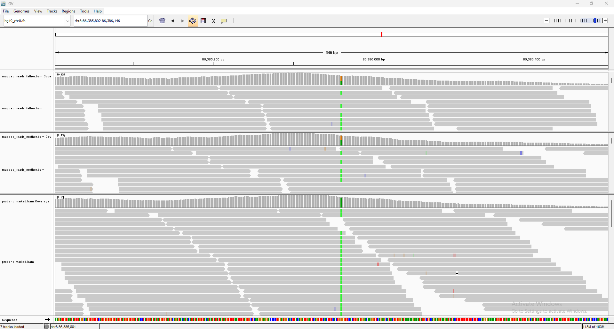
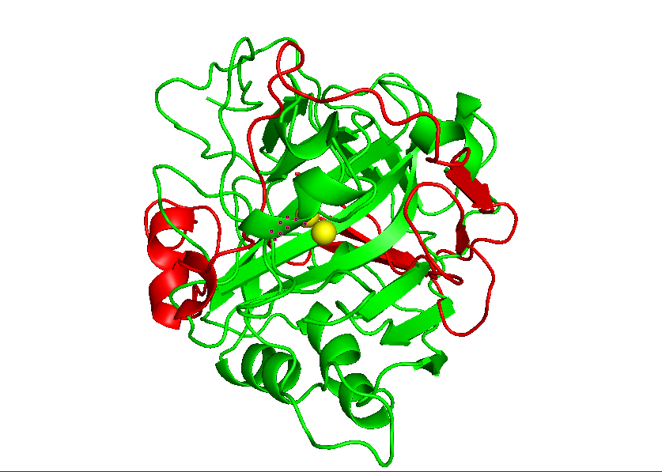

# Identification and Structural Analysis of a Causative Nonsense Mutation in the CA2 Gene for Osteopetrosis

## 1. Project Overview
This project demonstrates a complete clinical bioinformatics pipeline to identify the genetic cause of **Osteopetrosis** (Albers-Schönberg disease) in a pediatric patient. The study covers the entire workflow: from Raw Whole Exome Sequencing (WES) data processing to **3D Protein Structural Modeling**, providing a definitive molecular explanation for the disease phenotype.

## 2. Acknowledgments
The genomic data used in this project was provided for educational and research purposes by:
**Dr. Mohammed E. El-Asrag**
*Associate Professor in Medical Genomics and Bioinformatics, Aston University Medical School, UK.*

---

## 3. The Bioinformatics Pipeline
The analysis followed a rigorous clinical workflow:
1. **Mapping & Alignment:** Raw reads were aligned to the human reference genome (**hg19**) using `BWA-MEM`.
2. **Post-Alignment Processing:** Sorting and indexing were performed using `Samtools`.
3. **Variant Calling:** SNVs and Indels were called to generate a raw `VCF` file.
4. **Variant Annotation:** Functional annotation was performed using `SnpEff` to predict the biological impact of each variant.
5. **Filtering:** Variants were filtered based on Gene of interest (**CA2**), Functional impact (**HIGH**), and rarity.

---

## 4. Key Findings: The "Smoking Gun"
The pipeline successfully isolated a critical variant that explains the patient's symptoms:
- **Gene:** `CA2` (Carbonic Anhydrase II)
- **Location:** `chr8:86385980`
- **Mutation Type:** `Nonsense (Stop Gained)`
- **Protein Change:** `p.Trp97*` (Truncated protein)
- **Clinical Significance:** This mutation leads to a total loss of function of the Carbonic Anhydrase II enzyme.

---

## 5. Visual Validation (Trio Analysis)
Using **Integrated Genomics Viewer (IGV)**, a Trio Analysis was performed to confirm the inheritance pattern:

- **Proband (Patient):** Homozygous for the mutation.
- **Father:** Heterozygous (Carrier).
- **Mother:** Heterozygous (Carrier).
*This confirms an **Autosomal Recessive** inheritance pattern.*

---

## 6. Structural Impact: From Sequence to 3D Structure
To assess the functional damage, we utilized **AlphaFold 3** for protein folding prediction and **PyMOL** for comparative structural analysis.

### **Molecular Interpretation:**
The **p.Trp97*** mutation results in a truncated protein (**Red**) that lacks over 60% of its native structure (**Green**). 
- **Zinc Binding Loss:** The truncation removes the critical residue **His119**, which is one of the three essential residues for coordinating the catalytic Zinc ion (**Yellow sphere**).
- **Functional Failure:** Without the full active site, the enzyme cannot facilitate the acidification required for bone resorption, leading to **Osteopetrosis**.

---

## 7. Tools & Technologies
- **Genomics:** BWA-MEM, Samtools, SnpEff, IGV.
- **Structural Bioinfo:** **AlphaFold 3**, **PyMOL**.
- **Environment:** Linux/Bash (WSL).
